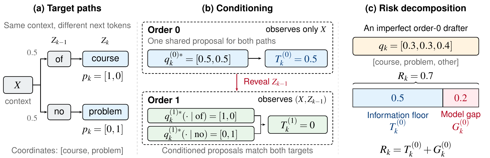
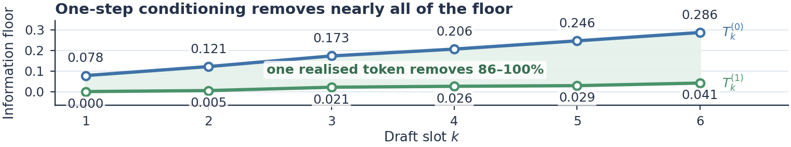
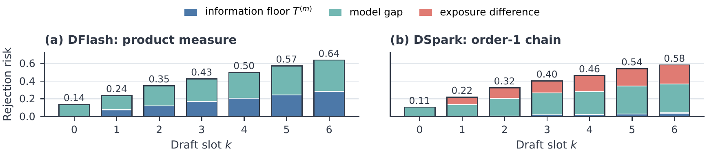
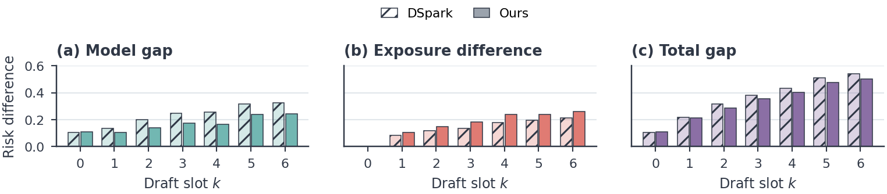

**TL;DR:** Block drafters guess a whole block of tokens in one pass, blind to what the earlier positions turn out to be. That blindness has a real cost, but seeing just one previous token wins almost all of it back. Today's drafters lose far more to modelling than to blindness. So we built a better head for the previous token, and made training 2× faster along the way.

Paper: [arXiv](https://arxiv.org/abs/2608.27339) · Code and data: [github.com/tie-pilot-qxw/specfloor](https://github.com/tie-pilot-qxw/specfloor) · Checkpoints: [Hugging Face](https://huggingface.co/TIE-Pilot/dspark-attnconv-block7-qwen3-4b)

---

## Speculative decoding in one minute

A big language model is slow because it writes one token at a time. Each token needs a full pass through the model.

Speculative decoding cheats a little. A small, fast drafter guesses the next few tokens. The big target model checks all the guesses in a single pass. We keep the guesses the target agrees with, and the target adds one token of its own at the end.

The nice part is that nothing changes about the output. The accept rule is built so that the final text follows exactly the target's distribution. You get the same model, just faster.

How much faster depends on one number: how many tokens you keep per round. People call it the accepted length. Everyone in this area is trying to push it up.

## From "one token at a time" to "the whole block at once"

Classic drafters, like the EAGLE family, still guess one token at a time. They are small, so each step is cheap. But if you want to guess 7 tokens, you still pay for 7 steps.

Block drafters take a different route. They guess the whole block in a single forward pass. Put 7 mask tokens after the context, run once, and read off 7 guesses.

The obvious win is speed. The bigger win is what that speed buys. An autoregressive drafter runs once per token, so it has to stay tiny: EAGLE-3 uses a single transformer layer. A block drafter pays for one pass no matter how many tokens it drafts, so it can afford to be much bigger. DFlash makes exactly this point. Its acceptance keeps going up as the drafter gets deeper, and a five-layer DFlash drafter guessing 16 tokens beats EAGLE-3 guessing 8 on both speed and acceptance. The released DFlash and DSpark drafters we study here both have five layers.

So parallel drafting is really a trade. You get a much stronger drafter, and you pay with blindness. When the drafter guesses position 3, it does not know what positions 1 and 2 turned out to be. Every position has to commit before it sees the tokens in front of it.

We call this **parallel blindness**. This post is about how much that side of the trade really costs.

## A short family tree

The block-drafting idea has a clear lineage, and it helps to see it in one place.

**Apple, "Your LLM Knows the Future" (2025).** The starting observation is in the title. The hidden states of an ordinary LLM already carry information about several future tokens. So they append mask tokens to the input and let the same model predict several future tokens at once. A gated LoRA keeps the original model's behaviour intact. And they add a tiny sampler: a two-layer MLP that looks at the token it just sampled, together with the hidden state of the next position, so the block reads as one coherent piece.

**DFlash.** DFlash keeps the "whole block in one pass" part and builds a strong, separate small drafter around it. The drafter reads hidden features from the target, and predicts all positions of a block in parallel. It is fully parallel inside the block. No position sees any other.

**DSpark.** DSpark adds a small sequential piece back on top of the parallel backbone. A Markov head lets each position react to the token right before it. It also adds confidence-scheduled verification, which decides how much of each block is worth checking in a busy serving system. DSpark runs in DeepSeek-V4's production serving.

Put side by side, these designs share one pattern: a parallel backbone that guesses the whole block, plus a small fix-up that looks at the previous token. Apple's sampler and DSpark's Markov head are two versions of that fix-up.

So the whole family is quietly betting on two things. First, that guessing blind loses something. Second, that looking at one previous token wins most of it back. As far as we know, neither had been measured.

## Two very different reasons to get rejected

When a drafted token gets rejected, there are two possible reasons.

1. **It couldn't see.** The right answer depends on tokens the drafter was not allowed to look at.
2. **It didn't use what it saw.** The information was there. The drafter just modelled it badly.

These call for opposite fixes. The first one says: give the drafter more history, even if that makes it more sequential and slower. The second one says: keep the same view, but build a better model.

The trouble is that accepted length mixes the two together. A drafter with a so-so accepted length could be blind, or clumsy, or both. You cannot tell from the number.

## The information floor

Here is the toy example from the paper.



Suppose that after some context, the target is equally likely to continue with "of course" or "no problem". Now look at the second word.

A blind drafter has to guess the second word without knowing whether the first word was "of" or "no". The best it can possibly do is split its bet: half on "course", half on "problem". Then it gets rejected half the time, however smart it is. That 0.5 is not a modelling mistake. It is the price of not seeing.

Now let the drafter see the first word. If it saw "of", it says "course". If it saw "no", it says "problem". The rejection drops to zero.

That is the whole idea. For any view the drafter is allowed to have, there is a lowest rejection that *no* drafter with that view can beat. We call it the **information floor**. Whatever a real drafter loses above the floor is the **model gap**.

In the toy, a real drafter that puts [0.3, 0.3, 0.4] on [course, problem, something else] gets rejected 70% of the time. 50 points of that are the floor. 20 points are the gap.

Two nice things make this measurable:

- The chance that a drafted token survives verification is exactly one minus the total-variation distance between the draft and the target. So rejection is a distance, and the floor is the smallest distance you can reach.
- The floor only needs the target model. We sample many continuations from the target, and find the single best proposal at each context. No drafter is involved.

One caveat: the floor is an oracle. It lets the proposal be perfect for every single context. So the model gap tells you how much room there is. It does not promise that any real architecture can close all of it.

## What we found

We measured floors and gaps on four open targets (Qwen3-4B, Qwen3-8B, Qwen3-14B and Gemma-4-12B), four kinds of prompts (math, code, instructions, long chat), and a frontier model behind an API (DeepSeek-V4-Pro). Here are the main takeaways.

### 1. Parallel blindness has a real cost, and it grows with depth



The blind floor starts at zero for the first position (nothing is hidden yet) and climbs steadily. On Qwen3-4B, at the last position of a 7-token block, even a perfect blind drafter cannot get more than about 71% acceptance there.

Longer blocks make it worse. At 16 tokens, the last position is capped at roughly half.

It is also uneven. At the early positions, most contexts lose almost nothing, and a small number of contexts, where the text could genuinely go several ways, carry most of the cost. Deeper in the block the cost spreads out, but it stays lopsided. Open-ended chat pays more than math or code, because there are simply more ways to continue.

### 2. One token fixes almost all of it

Now let each position see just the one real token right before it. The floor drops by 86–100% at every position. With 16-token blocks, one token still removes most of it.

A completely separate test agrees. Using mutual information instead of rejection, one previous token recovers almost all of the useful information about the path, and two tokens recover nearly everything.

Why is one token enough? Because the target's continuations are very concentrated. Usually there are only a couple of likely paths, like "of course" and "no problem". Once you see which road the text took, the rest is mostly settled.

The frontier model shows the same pattern.

So the family's bet on structure is right. A small order-1 fix-up, like Apple's sampler or DSpark's Markov head, is enough in principle to undo parallel blindness.

### 3. But today's drafters sit far above their floors



For DFlash on Qwen3-4B, the model gap is the bigger part of the rejection at every position. Across the four targets, it is roughly 40% to 65% of the rejection at the last position.

DSpark is more striking. Its order-1 floor is tiny. Even when we hand its Markov head the *true* previous token, 85% or more of its rejection is model gap. It has the information. It just doesn't turn it into acceptance.

When DSpark uses its own guessed previous token instead of the true one, rejection gets worse again. We call this extra the exposure difference. It shows how sensitive the head is to its own mistakes.

For the frontier model we cannot run the drafter ourselves, so the comparison is indirect. But it points the same way: its order-1 floor is small, while its published serving numbers imply a much larger rejection.

So the bottleneck is not what drafters can see. It is how well they use it.

### 4. Serving adds a twist: survival

In real serving, verification stops at the first rejection. A late position only counts if everything before it was accepted. And the paths that survive that long are exactly the easy ones.

So the rejection you see at deep positions in serving is much lower than the raw number. And fixing a position is worth more the earlier it is. For DFlash, the model gap grows with depth, but the payoff from fixing a single position shrinks with depth. The first positions protect everything behind them. This lines up with the DSpark authors' own view that strong early predictions matter most.

## So what should change?

Not the amount of history. One token is already enough.

What should change is how the drafter uses that one token.

Look at DSpark's Markov head. It adds a correction that depends only on the previous token. So when the previous token changes, the drafter's preferences for the next token shift in the same way in *every* context. A better backbone does not change that.

But the information allows much more. The same previous token can call for different next tokens depending on the context. "Of" can lead to "course" in one sentence and "the" in another. An additive correction has a hard time saying that. Apple's MLP sampler mixes the previous token with the position's state, which is richer. We wanted to go one step further, and let the previous token actually look back at the context.

## Our fix: a prefix-attention head

The head is simple.

1. Take the previous token's embedding and the drafter's state for this position, and turn them into a query.
2. Use that query to attend over the features of the context that is already committed.
3. Pass the result through a small MLP, and add it to the backbone's logits.

In plain words: the previous token gets to ask the context "given that I came right before you, what should come next?"

Importantly, the head sees exactly what DSpark sees: the committed context plus one previous token. Its floor is the same. Any gain has to come from using that information better, not from seeing more.

We also borrow a few things that fit the heavier head. From DFlash2, we take top-16 candidate scoring and a short lattice walk to pick the draft chain. We add a small two-tap convolution in the backbone, learned slot embeddings, and a loss that teaches the backbone to nominate good candidates.

Results on Qwen3-4B, against the released DSpark checkpoint:



- The model gap drops at every position after the first. At the last position it shrinks by about a quarter, with the floor unchanged.
- Mean accepted length goes up by 3–4% across nine benchmarks.
- It is faster end to end at both temperatures (about 3.6× → 3.8× over plain decoding at temperature 0, and 3.3× → 3.5× at temperature 1), even with the heavier head.

One honest caveat: the exposure difference got larger. A head that is better when given the right previous token is not automatically more robust to a wrong one. That is still open.

## Making it cheap to train, and fast to serve

A heavier head is only useful if it doesn't make everything slower. So we spent real time on the infrastructure, for both training and serving.

**Training: from about 30 to about 15 seconds per step.** Our starting point was [DeepSpec](https://github.com/deepseek-ai/DeepSpec), the training code the DSpark authors open-sourced, with its released Qwen3-4B settings (4 H100s, global batch 512). We made one change before anything else. DeepSpec trains against a precomputed cache of the target's outputs, and for Qwen3-4B that cache is about 38 TB. We could not store that, so we run the frozen target online, inside the training loop.

On that setup, the released DSpark architecture trained at about 24 s per optimizer step, and our heavier drafter at about 30 s. After the changes below, our drafter trains at about 15 s per step, on the same hardware with the same per-GPU work. That is almost exactly 2×. It is even faster than the original DSpark architecture was before these changes, and it turned a 10-epoch run from about 8.4 days into 4.6.

Nothing here is a clever trick. Each fix came from a profiler trace that showed where the time was actually going.

- **Normalize the loss once per step, not once per micro-batch.** Each optimizer step has 128 micro-batches per GPU. Before, every micro-batch needed its own token count from all the GPUs, so the GPUs kept waiting for each other. Now each micro-batch only adds up its own share, and there is one sync at the end of the step. About 6% faster. This one also changes the loss weighting slightly, so it is not a pure speedup. But we think the new weighting makes more sense. Every token in a step now gets the same weight, no matter how the batch is split across GPUs and micro-batches. With per-micro-batch normalization, a token's weight depends on which other sequences happened to land in the same micro-batch.
- **A fused teacher.** The frozen Qwen3 target runs on every micro-batch, and it was the only part still running as plain eager Hugging Face code. We rewrote it as a prefill-only forward: merged QKV and gate/up matmuls, fused norm, RoPE and activation kernels, and FlashAttention-3. The teacher alone got 1.7–2.3× faster. (This one only matters if you run the target online, as we do.)
- **A compiled loss.** The L1 loss over the full vocabulary used to build two huge fp32 probability tensors. `torch.compile` removes them. Together with the fused teacher, this took about 22% off the step.
- **One top-k instead of two.** The trace showed that a top-k over the full vocabulary cost more than either lm_head. It was done twice, once in fp32 for no reason. Now it is done once, in bf16.
- **Take the frozen tables out of FSDP.** This was the biggest single win, and the least expected. FSDP had flattened the whole model into one big parameter. The frozen embedding and lm_head are more than half of all the weights, but because they were inside that parameter, they still took part in every gradient operation. Stock DeepSpec wraps the model the same way. Keeping them out took another 13% off the step, and saved 3 GB of memory.

We checked every change against the old code: the same step-1 loss, and checkpoints that load the same way. All of these switches are in the released training code.

**Serving: a heavier head that still runs faster.** On the SGLang side, the head's projections are precomputed, its context keys and values are written by one fused kernel, the short convolution runs as Triton kernels, and the whole candidate lattice walk lives inside the CUDA graph. That is why the new drafter is faster end to end, even though its head does more work.

## Takeaways

1. Guessing a whole block blind has a real, measurable cost, and it grows with block length.
2. One real previous token wins almost all of it back.
3. Today's block drafters lose much more to modelling than to blindness.
4. So the next gains are in how drafters use the previous token and the context, and in the first positions of the block.
5. Engineering matters as much as modelling: profiling the training loop halved our step time, and it is what made a 10-epoch run affordable.

## Try it

Everything is open:

- **Code and data:** [github.com/tie-pilot-qxw/specfloor](https://github.com/tie-pilot-qxw/specfloor). It includes the measurement package, every measurement record behind the paper, the drafter training code with all the speedups above, and the SGLang patch. A few commands recompute every number in the paper from the archived records, and none of them needs a GPU.
- **Checkpoints:** [our drafter](https://huggingface.co/TIE-Pilot/dspark-attnconv-block7-qwen3-4b) and [the one-epoch variants](https://huggingface.co/TIE-Pilot/deepspec-drafter-ablations).
- **Paper:** [arXiv](https://arxiv.org/abs/2608.27339).

If you work on drafters, the floor is cheap to measure for your own model. It only needs samples from the target. We'd love to hear what you find.

## Citation

If you find this work useful, please cite:

```bibtex
@misc{qiang2026parallelblindnessinformationfloors,
      title={Beyond Parallel Blindness: Information Floors and Model Gaps in Block Drafting}, 
      author={Xinwei Qiang and Xiang Fang and Chang Chen and Zaifeng Pan and Yue Guan and Yufei Ding},
      year={2026},
      eprint={2608.27339},
      archivePrefix={arXiv},
      primaryClass={cs.LG},
      url={https://arxiv.org/abs/2608.27339}, 
}
```
